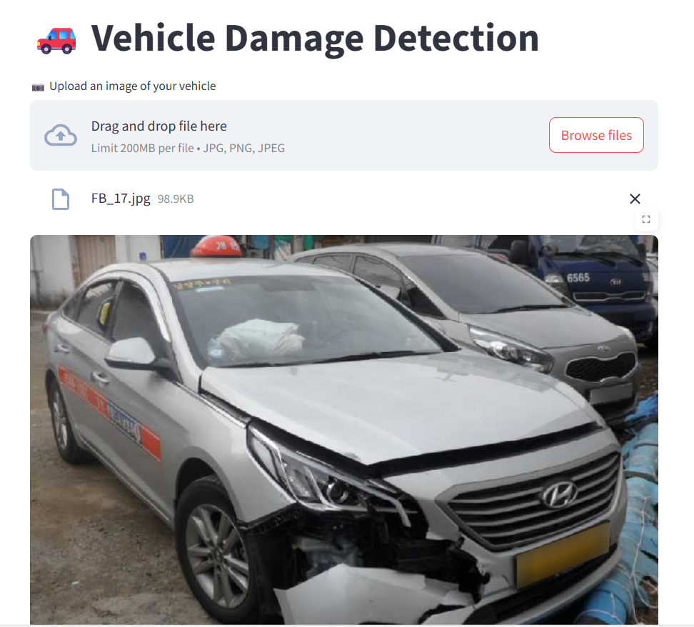

# 🚗 Vehicle Damage Detection AI

**Vehicle Damage Detection AI** is an intelligent tool that analyzes images of a vehicle and automatically detects front or rear damage. Designed for car owners, garages, and insurance companies, it provides quick, actionable insights for damage assessment and repair recommendations.

---

## 🔑 Key Features
- **Upload an Image:** Drag and drop a photo of your car’s front or rear.  
- **Instant Damage Detection:** AI predicts damage type in real time.  
- **Confidence Score:** Displays model certainty for transparency.  
- **Actionable Recommendations:** Provides clear guidance for repairs or next steps.  
- **Web App Interface:** Built with Streamlit for easy browser access.  

---

## 🛠️ Technology Stack
- **Python** – Core programming language  
- **PyTorch & Torchvision** – Deep learning model (ResNet50) and image transforms  
- **Streamlit** – Interactive web interface  
- **PIL (Python Imaging Library)** – Image processing  

---

## 📊 How It Works
1. Preprocesses the uploaded image.  
2. Uses a fine-tuned **ResNet50** model to classify vehicle damage into six categories:  

| Damage Class       | Description                  |
|------------------|-----------------------------|
| Front Breakage    | Visible cracks or damage in front |
| Front Crushed     | Severe crush damage in front |
| Front Normal      | No visible damage in front |
| Rear Breakage     | Visible cracks or damage in rear |
| Rear Crushed      | Severe crush damage in rear |
| Rear Normal       | No visible damage in rear |

3. Outputs the predicted class, confidence score, and repair recommendation.  
4. Designed for quick, real-world use by garages, insurance agents, and vehicle owners.  

**Model Performance:**  
- Validation Accuracy: **94%**  
- F1-score: **0.92**  
- Robust against diverse image angles and lighting conditions  

---

## 📂 Project Structure
```

├── app.py                 # Streamlit web application
├── model\_helper.py        # Model loading and prediction logic
├── model/
│   └── saved\_model.pth    # Trained model weights
├── requirements.txt       # Python dependencies
├── README.md              # Project documentation

````

---

## 🚀 Quick Start
1. **Clone the repository:**  
```bash
git clone https://github.com/imran6999/vehicle-damage-detection.git
cd vehicle-damage-detection
````

2. **Install dependencies:**

```bash
pip install -r requirements.txt
```

3. **Add your trained model:**
   Place the trained model checkpoint in `/model/saved_model.pth`.
4. **Run the web app:**

```bash
streamlit run app.py
```

5. **Open in your browser** and upload a vehicle image to see instant results.

```
Damage: Front Breakage
Confidence: 97.5%
Recommendation: Inspect bumper, grille, or headlights for cracks or loose parts. Visit a certified body shop to prevent further deterioration.
```

---

## 📈 Benefits

* **Time-saving:** Instant damage assessment without a garage visit.
* **Cost-efficient:** Helps decide if minor repairs or insurance claims are needed.
* **Transparent:** Confidence scores indicate AI certainty.
* **Actionable:** Recommendations guide users on next steps.

---

## ✨ Future Improvements

* Multi-angle image support
* Repair cost estimation
* Integration with insurance claim systems
* Before-and-after damage comparison

---

## 🌐 Deployment
Platform: Streamlit Cloud
Link: https://vehicle-damage-detection.streamlit.app/

## 📸 Screenshots

<!-- Add screenshots or GIFs of this app here -->




## 👨‍💻 Author
Imran Chowdhury
Data Scientist | AI Enthusiast


